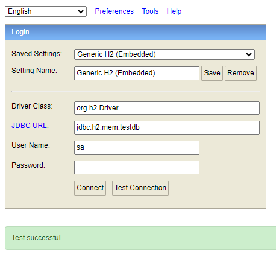
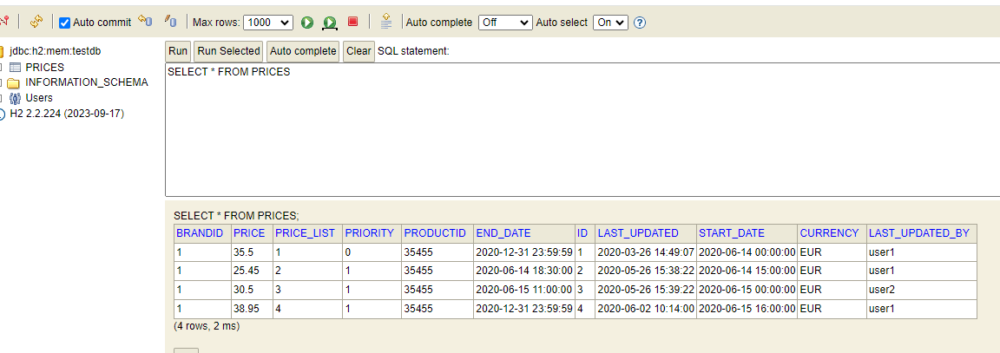

# Kairós technical test

## Description

This project sets up code structure to store and manage Prices with the following structure:
    BRAND_ID START_DATE END_DATE PRICE_LIST PRODUCT_ID PRIORITY PRICE CURR

The code automatically creates a temporal h2 database that stores 4 rows with sample data.

### H2 database
Database created in local memory, loaded with data in execution time. This database is deleted when the application ends and gets re-created each time with the contents of techtest\src\main\resources\static\data.sql

## How to

In order to check manually the database, run the code and then access http://localhost:8080/h2-console using the password 'pw' (as set in the application.properties)

In order to run the tests, run the test method validationTests() in techtest\src\test\java\com\kairos\techtest\ControllerTests.java

## Tests

There are 6 tests implemented in the code. The first one is a simple test just for checking the contents of the h2 database. 
The rest are simulations of REST call (as one could do using Postman or any other similar program). 
These tests do NOT require the code to be launched
1. A simple count of the database rows, which should be 4 when loading the data from data.sql
2. Petition for product 35455 of brand 1 at 2020-06-14 10:00:00
    This test returns the 1st object in the sample data with price 35.5
3. Petition for product 35455 of brand 1 at 2020-06-14 16:00:00
    This test returns the 2nd object in the sample data with price 25.45
4. Petition for product 35455 of brand 1 at 2020-06-14 21:00:00
    This test returns the 1st object in the sample data with price 35.5
5. Petition for product 35455 of brand 1 at 2020-06-15 10:00:00
    This test returns the 3rd object in the sample data with price 30.5
6. Petition for product 35455 of brand 1 at 2020-06-16 21:00:00
    This test returns the 4th object in the sample data with price 38.95
